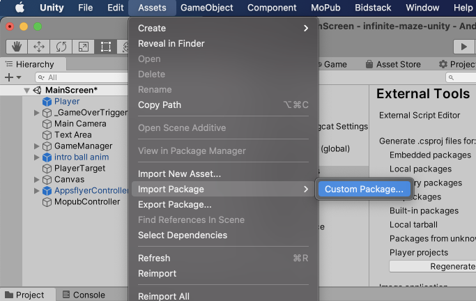
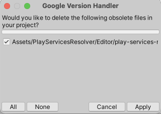
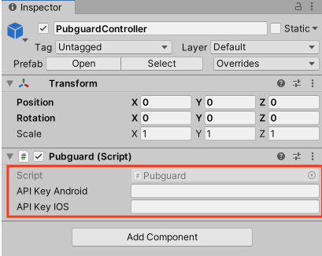

  

# Pubguard Unity Plugin

A guide to installing Pubguard on your Unity3D project

The Pubguard Library is a solution that monitors the advertising content flowing through your mobile app, protecting against unwanted content and optimizing revenues.

The data from the library is then accessible via your account on the Pubguard dashboard where you can set up preferences, alerts and browse the gallery.

---

# Table of contents

- [Getting Started](#getting-started)
- [Requirements](#requirements)
- [Integrating](#integrating)
- [Versioning](#versioning)
- [License](#license)

---

# Getting Started

These instructions will enable you to get the Pubguard library running on your Unity project.
- Android instructions can be found [here](https://github.com/bidstack-group/pubguard-sdk-android)  
- iOS instructions can be found [here](https://github.com/bidstack-group/pubguard-sdk-ios)

## Prerequisites

Before installing the Pubguard library you will need an application key that is available from your account, to receive an API key please sign up from http://dashboard.pubguard.com or email support@pubguard.com. The key is used in both the iOS and Android installations.

## Requirements

- Unity3D starting from 2019.2

---

# Integrating

1. Download the Pubguard.unitypackage form [releases](https://github.com/bidstack-group/pubguard-unity-plugin/releases)

1. Open your project in the Unity editor. Select **Assets > Import Package > Custom Package** and find the Pubguard.unitypackage file you downloaded

2. Make sure all of the files are selected and click **Import**.

3. Pubguard Unity Plugin uses External Dependency Manager for Unity to resolve dependencies. If you have used External Dependency Manager before you can see an offer to delete outdated files, click **Apply**

4. **(only for Android)** In the Unity editor, select **Assets > External Dependency Manager > Android Resolver > Force Resolve** (If you make any changes which affect Android dependencies, then run Resolver again)

5. Add **PubguardController** prefab:
    - From **Project** tab expand **Assets > Prefabs**
    - Drag and Drop **Pubguard** prefab to the Project Hierachy list
    - The **PubguardController** shoud appear in the Hierachy list as shown on the image below

6. Click on the **PubguardControler** and from the Inspector tab enter the Pubguards's Application Key.
   Check the [Prerequisites](#Prerequisites) section explaining how to obtain the Application Key.

---

# Versioning

Please use the most up to date version at all times to ensure maximum support.

---

# License

_© 2021 Minimised Media Limited (Pubguard© 2019 All Rights Reserved)_